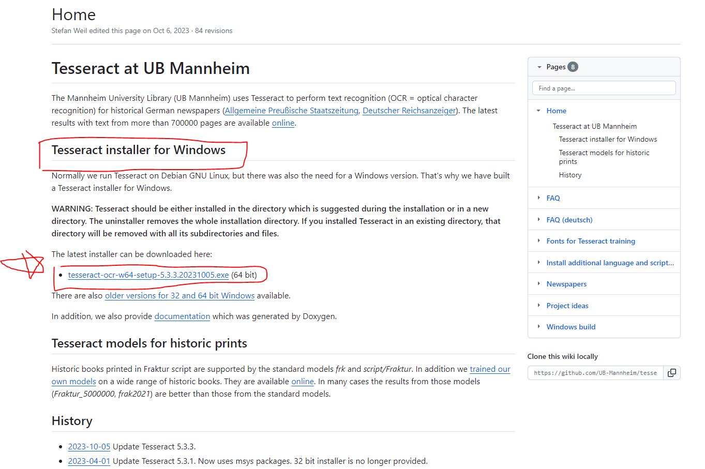
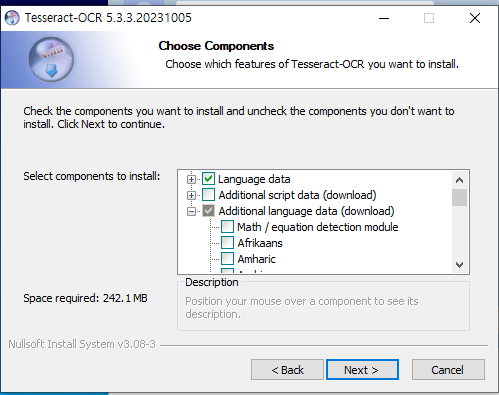

# collaboration_tool_project
 Implementing teamup tools using Django Framework and React Nactive

스마트 챗: OCR, NER, STT 기능을 갖춘 통합 Ai 기반 협업 플랫폼

# 구현
Django + react_native + mongo DB + redis

- 대화 내용 요약 기능
-  Django를 활용한 실시간 비동기 채팅 시스템 개발
-  React를 활용한 UI/UX 설계 및 구축
- NER, OCR, Speech To Text를 활용하여 관련 기능을 탑재한 AI 챗봇 개발
- 손쉬운 일정 관리 기능 구현

  

# Tesseract 설치 - windows 버전.

(권장)원본 설치링크
https://github.com/UB-Mannheim/tesseract/wiki

설치 바로가기 링크
https://digi.bib.uni-mannheim.de/tesseract/tesseract-ocr-w64-setup-5.3.3.20231005.exe
테서렉트☎립버전5.3.x☜☜♤무료◆다운◆로드※√ (무설치) 바로가기

# 반드시 Additional Language Data(download) 에서 Korean 체크할 것

### Window 사용시, 테서렉트 환경변수 설정할 것

